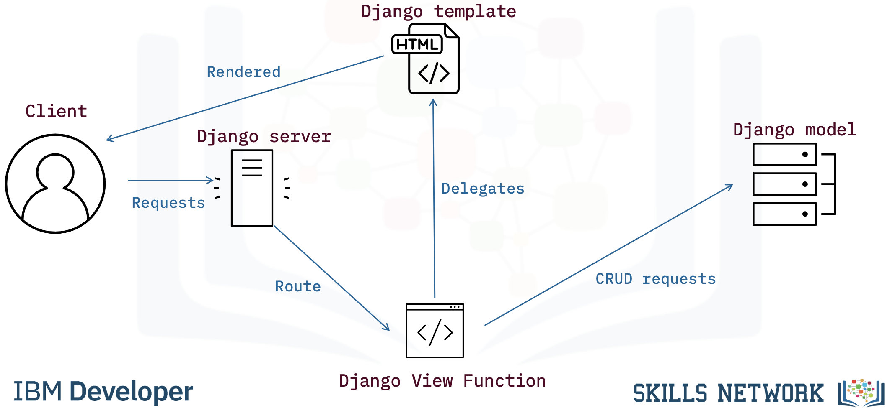
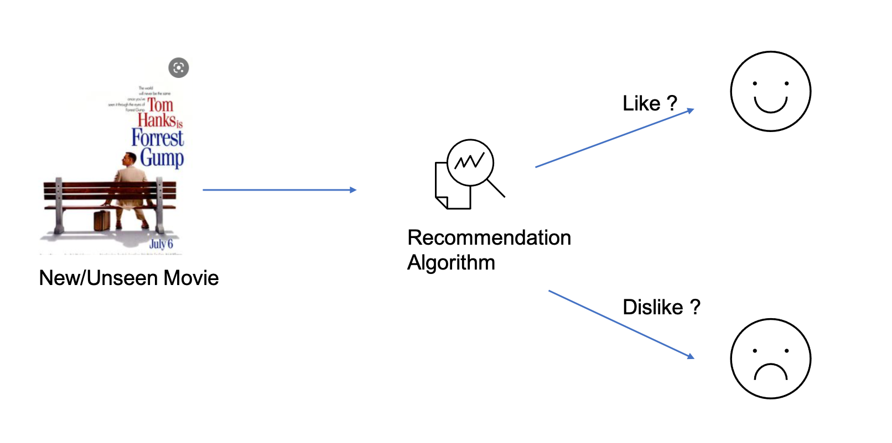

# MovieRecommender

## Project Description
Are you tired of endlessly scrolling through streaming platforms, trying to find the perfect movie for your weekend movie night? Introducing our Personalized Movie Recommender! This Django-based web application takes the guesswork out of choosing a movie by providing tailored recommendations based on your or your family's viewing history.

### Django Model-View-Template

### CMD to Generate Recommendations

## Credits:
This project is part of edX Movie Recommender with Django guided project.

